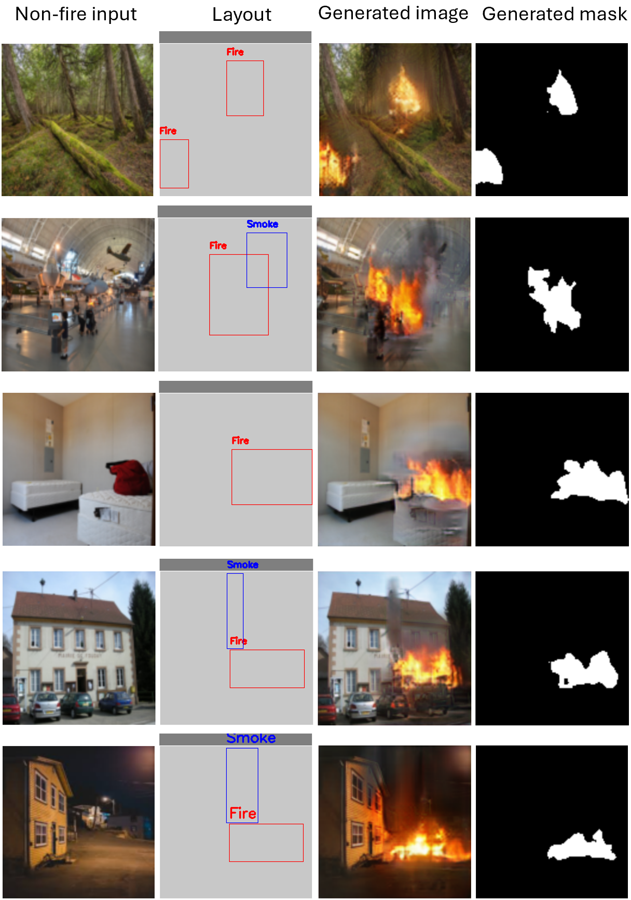

## 📌 Requirements:
- Python: 3.9
- Torch: 1.13.1
- Cuda: 11.6.3
- Cudnn: 8.4.1

# Fire Image Generation Based on Image-to-Image and Layout-to-Image Translations for Detection and Segmentation Tasks

Official implementation and benchmark results for the paper: **"Fire Image Generation Based on Image-to-Image and Layout-to-Image Translations for Detection and Segmentation Tasks", IEEE Access, July 2026**.

---

## 📌 Summary


With the remarkable progress in fire detection and segmentation models, it has become crucial to build more diverse labeled datasets to ensure efficient training. However, fire incidents are rare, and intentionally setting fires for data collection is typically prohibited due to safety regulations. This project introduces a conditional GAN-based framework combining **Image-to-Image (I2I)** and **Layout-to-Image (L2I)** translation models to synthesize realistic fire and smoke images complete with automatic segmentation masks.

By leveraging spatial bounding box layouts over non-fire input scenes, the framework generates realistic fire and smoke objects that integrate naturally into diverse environments. The resulting synthetic data substantially boosts the performance of downstream **object detection** and **semantic segmentation** models.

---

## 🖼️ Generation Results

The proposed framework takes a **non-fire background image** and a specified **layout (bounding boxes for fire/smoke)** to produce realistic **generated images** alongside paired **binary segmentation masks**.



*Figure 6. The generation results of the proposed method in various scenarios under different random input layouts.*

---

## 📊 Benchmarks

### 1. Fréchet Inception Distance (FID)
The proposed approach produces high-fidelity outputs competitive with state-of-the-art generation methods:

| Method | FID Score ↓ |
| :--- | :---: |
| **RDAGAN** | 95.24 |
| **LostGANv2** | 75.15 |
| **PaintByExample** | 73.52 |
| **Proposed method** | **68.73** |
| **LayoutDiffusion** | 64.89 |

---

### 2. Detection Augmentation Performance Improvement

Adding synthetic images generated by the proposed method significantly improves downstream detection capabilities (mAP, $\text{AP}_{\text{fire}}$, $\text{AP}_{\text{smoke}}$) compared to baseline datasets and competing augmentation pipelines.

| Augmentation Method | Training Set | mAP (%) | $\text{AP}_{\text{fire}}$ (%) | $\text{AP}_{\text{smoke}}$ (%) |
| :--- | :--- | :---: | :---: | :---: |
| **None** | vanilla set | 58.8 | 67.9 | 49.7 |
| | vanilla set + 3,040 non-fire images | 59.4 | 68.9 | 49.8 |
| **RDAGAN** | vanilla set + 2,000 augmented images | 59.9 | 69.6 | 50.1 |
| | vanilla set + 4,000 augmented images | 60.2 | 70.1 | 50.3 |
| **LostGANv2** | vanilla set + 2,000 augmented images | 61.0 | 70.8 | 51.2 |
| | vanilla set + 4,000 augmented images | 61.2 | 71.1 | 51.3 |
| **LayoutDiffusion** | vanilla set + 2,000 augmented images | 61.8 | 72.0 | 51.6 |
| | vanilla set + 4,000 augmented images | 62.2 | 72.5 | 51.9 |
| **PaintByExample** | vanilla set + 2,000 augmented images | 62.0 | 72.5 | 51.5 |
| | vanilla set + 4,000 augmented images | 62.3 | 72.6 | 51.9 |
| **Proposed method** | vanilla set + 2,000 augmented images | 62.8 | 72.8 | 52.8 |
| | **vanilla set + 4,000 augmented images** | **63.4** | **73.5** | **53.2** |

---

### 3. Segmentation Augmentation Performance Improvement

The auto-generated segmentation masks allow direct data augmentation for downstream semantic segmentation, leading to state-of-the-art mIoU and Dice coefficient scores.

| Augmentation Method | Training Set | mIoU (%) | Dice Coefficient (%) |
| :--- | :--- | :---: | :---: |
| **None** | vanilla set | 75.68 | 85.02 |
| | vanilla set + 1,000 non-fire images | 75.87 | 85.29 |
| **LostGANv2** | vanilla set + 500 augmented images | 77.28 | 86.45 |
| | vanilla set + 1,000 augmented images | 77.91 | 86.61 |
| **Proposed method** | vanilla set + 500 augmented images | 79.23 | 88.14 |
| | **vanilla set + 1,000 augmented images** | **80.12** | **88.39** |

---

## 📖 Citation

If you find this repository or method useful in your research, please cite our work:

```bibtex
@article{fire_gen_2026,
  title={Fire Image Generation Based on Image-to-Image and Layout-to-Image Translations for Detection and Segmentation Tasks},
  author={X.N. Huynh, J.K. Suhr},
  journal={IEEE Access},
  year={2026}
}
```